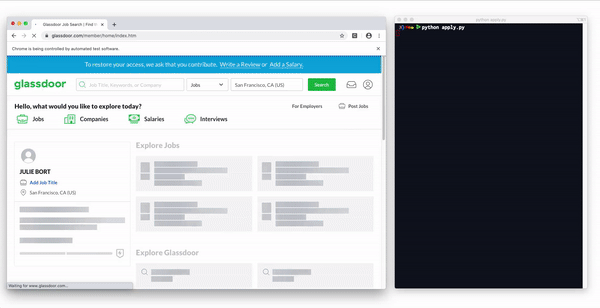

# Software Engineering Job Application Bot (2.0) 👩🏾‍💻
#### 5 Python Projects in 5 Days - Day 5: Scripting

A script to automatically search Glassdoor for job listings, aggregate every application URL, and apply to each job using pre-populated data. ***All with one click!***

**📸YouTube Tutorial: [https://youtu.be/N_7d8vg_TQA](https://youtu.be/N_7d8vg_TQA)**

## Inspiration
Ever sit at your desk for hours, clicking through endless job listings hoping to strike gold with one response? To solve this, I made a script a few months ago, which would take in a list of job URLs and automatically apply to potentially 100s of jobs with the click of a button. This was great, but there was one problem — the process of aggregating those links is painstaking. So, I wanted to automate that process with this project! ✨

## Installation
1. Install [ChromeDriver](https://sites.google.com/a/chromium.org/chromedriver/) (or an alternatie driver for your browser of choice):
   * Run `brew cask install chromedriver`
   * Confirm installation: `chromedriver --version`
   * Check location of ChromeDriver: `which chromedriver`
   * Wherever the `driver` is initialized in the code, insert the ChromeDriver location
2. Install Selenium: `pip install selenium`
3. Install BeautifulSoup: `pip install beautifulsoup4`

## Usage
#### To test `get_links.py`
1. Uncomment the last line `get_links.py`
2. Run `$ python get_links.py`

#### To run the entire script:
1. Set a number of pages you'd like to iterate through here
2. Run `$ python apply.py`
3. The script will open [glassdoor.com](https://www.glassdoor.com/index.htm), at which point you should log-in
4. From there on, everything is automatic!

## Thanks

* [Selenium](https://selenium-python.readthedocs.io/) - A tool designed for QA testing, but that actually works great for making these types of bots
* [Beautiful Soup](https://www.crummy.com/software/BeautifulSoup/doc) - A tool to scrape HTML/XML content (that saved be *big time* with this project)

## Learn More

* [My Previous Video](https://www.youtube.com/watch?v=nRmrEC5WnzY) - For more background on the `apply.py` code

## License

This project is licensed under the MIT License - see the [LICENSE.md](https://github.com/harshibar/5-python-projects/blob/master/LICENSE) file for details.
